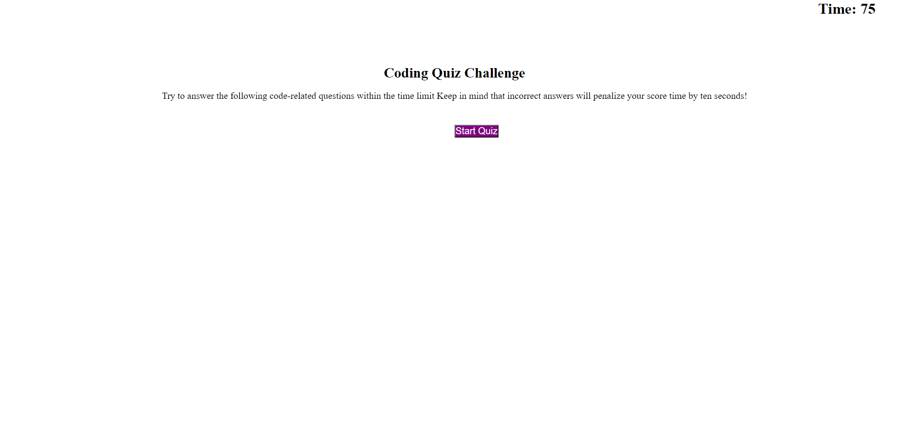

# javaCodeQuiz


## Acceptance Criteria

```
1. When taking a code quiz, 
a timer will start and you are presented with a question

2. When you answer a question, 
then you are presented with another question

3. When you answer a question incorrectly, 
then time is subtracted from the clock

4. When all questions are answered, 
or the timer reaches 0 then the game is over

5. When the game is over, 
Then I can save my initals and my score
```
## Mock-Up
The following image shows the web application's apperance and functionality:



# Website Link
https://dextervorbe.github.io/javaCodeQuiz/